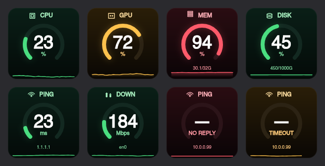

# System Monitor for Elgato Stream Deck

A Stream Deck plugin that shows live macOS system stats — one metric per key, fully configurable.



## Actions

| Action | What it shows | Configurable |
|--------|--------------|--------------|
| **CPU** | CPU usage % with sparkline | Refresh rate, warn/crit thresholds |
| **GPU** | GPU utilization % via `ioreg` | Refresh rate, warn/crit thresholds |
| **Memory** | RAM usage % (used/total) | Refresh rate, warn/crit thresholds |
| **Storage** | Disk usage % (used/total) | Mount point, refresh rate, warn/crit |
| **Ping** | Latency to a remote host | Host, timeout, refresh rate, warn/crit |
| **Network** | Download/upload throughput bars | Interface, display mode, unit, refresh rate |

Each key renders a live 144×144 image with:
- Color-coded ring gauge (green → yellow → red) based on your thresholds
- Sparkline showing recent history
- Network uses dual bar charts (download + upload) with link-speed scaling

## Install

### From release
Download the `.streamDeckPlugin` file from [Releases](https://github.com/perrosenlind/elgato-app/releases) and double-click it.

### From source
Requires Node.js 20+ and Stream Deck 6.5+ on macOS 12+.

```bash
git clone https://github.com/perrosenlind/elgato-app.git
cd elgato-app
npm install
npm run deploy
```

This builds the plugin, generates icons, links it into Stream Deck, and restarts the app. Drag any "System Monitor" action onto a key.

## Development

```bash
npm run build       # Build once
npm run watch       # Rebuild on changes
npm run deploy      # Build + link + restart Stream Deck
npm run icons       # Regenerate action icons
npm run preview     # Render preview PNG to /tmp/elgato-deck-preview.png
npm run pack        # Create distributable .streamDeckPlugin installer
```

After editing source files, run `npm run deploy` to rebuild and reload the plugin on your deck.

## How it works

- **Rendering**: Each key image is drawn on a canvas (`@napi-rs/canvas`) and sent via `setImage()`. No HTML overlay — pure PNG rendering for crisp visuals.
- **Sampling**: A shared sampler deduplicates polling when multiple keys show the same metric. Each metric maintains a 30-sample ring buffer for sparkline history.
- **GPU**: Uses `ioreg -r -d 1 -w 0 -c IOAccelerator` to read GPU utilization on macOS. Works on Apple Silicon and Intel Macs. Shows "—" if the GPU doesn't expose utilization.
- **Ping**: Spawns `/sbin/ping` with a configurable timeout. Turns red when the host is unreachable, yellow when connectivity is degrading.
- **Network**: Auto-detects the active interface. Bar heights scale against the interface's link speed. Supports fixed units (bps/Kbps/Mbps/Gbps) or auto-scaling.

## Requirements

- macOS 12+
- Stream Deck 6.5+
- Stream Deck hardware (tested on Stream Deck MK.2)

## License

MIT
